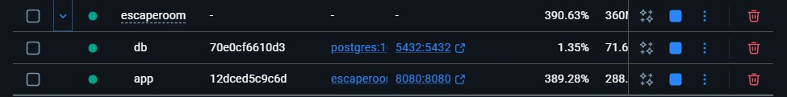
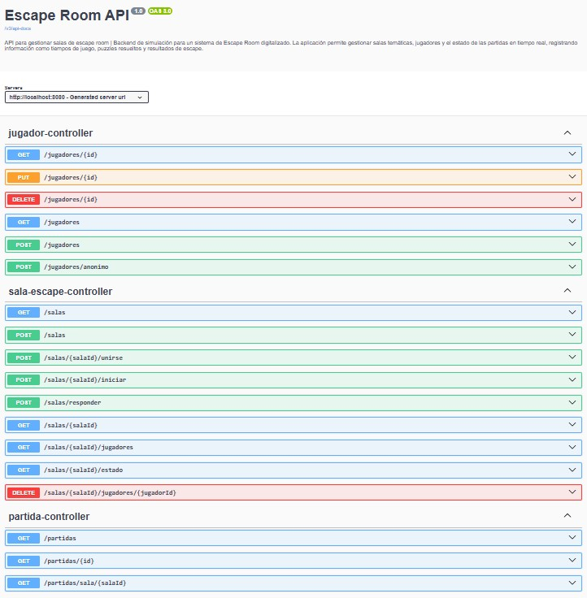

# Infraestructura Docker — Bloque A

## docker-compose.yml

```yaml
services:

  ### ── Base de datos PostgreSQL ──────────────────────────────
  db:
    image: postgres:16-alpine
    container_name: escaperoom-db
    restart: unless-stopped
    environment:
      POSTGRES_DB: escaperoom
      POSTGRES_USER: ${DB_USERNAME:-postgres}
      POSTGRES_PASSWORD: ${DB_PASSWORD:-postgres}
    ports:
      - "5432:5432"
    volumes:
      - postgres_data:/var/lib/postgresql/data
    healthcheck:
      test: ["CMD-SHELL", "pg_isready -U ${DB_USERNAME:-postgres} -d escaperoom"]
      interval: 10s
      timeout: 5s
      retries: 5

  ### ── Aplicación Spring Boot ────────────────────────────────
  app:
    build:
      context: .
      dockerfile: Dockerfile
    container_name: escaperoom-app
    restart: unless-stopped
    depends_on:
      db:
        condition: service_healthy
    ports:
      - "8080:8080"
    environment:
      ### Sobreescribe application.properties para usar PostgreSQL
      SPRING_DATASOURCE_URL: jdbc:postgresql://db:5432/escaperoom
      SPRING_DATASOURCE_DRIVER_CLASS_NAME: org.postgresql.Driver
      SPRING_DATASOURCE_USERNAME: ${DB_USERNAME:-postgres}
      SPRING_DATASOURCE_PASSWORD: ${DB_PASSWORD:-postgres}
      SPRING_JPA_DATABASE_PLATFORM: org.hibernate.dialect.PostgreSQLDialect
      SPRING_JPA_HIBERNATE_DDL_AUTO: update
      # Desactivar H2 en producción
      SPRING_H2_CONSOLE_ENABLED: "false"

volumes:
  postgres_data:
```

# Docker Compose — Escape Room

## Servicios

###️ Base de datos — PostgreSQL

```yaml
db:
  image: postgres:16-alpine
  container_name: escaperoom-db
  restart: unless-stopped
```

| Variable de entorno | Valor por defecto | Descripción                                    |
|---------------------|-------------------|------------------------------------------------|
| `POSTGRES_DB`       | `escaperoom`      | Nombre de la base de datos                     |
| `POSTGRES_USER`     | `postgres`        | Usuario (sobreescribible con `DB_USERNAME`)    |
| `POSTGRES_PASSWORD` | `postgres`        | Contraseña (sobreescribible con `DB_PASSWORD`) |

- **Puerto expuesto:** `5432:5432`
- **Volumen persistente:** `postgres_data` → `/var/lib/postgresql/data`

**Healthcheck:**
```
pg_isready -U <usuario> -d escaperoom
```
> Intervalo: `10s` · Timeout: `5s` · Reintentos: `5`

---

### Aplicación — Spring Boot

```yaml
app:
  build:
    context: .
    dockerfile: Dockerfile
  container_name: escaperoom-app
  restart: unless-stopped
  depends_on:
    db:
      condition: service_healthy
```

- **Puerto expuesto:** `8080:8080`
- **Depende de:** `db` (espera a que pase el healthcheck)

**Variables de entorno:**

| Variable                              | Valor                                     |
|---------------------------------------|-------------------------------------------|
| `SPRING_DATASOURCE_URL`               | `jdbc:postgresql://db:5432/escaperoom`    |
| `SPRING_DATASOURCE_DRIVER_CLASS_NAME` | `org.postgresql.Driver`                   |
| `SPRING_DATASOURCE_USERNAME`          | `${DB_USERNAME:-postgres}`                |
| `SPRING_DATASOURCE_PASSWORD`          | `${DB_PASSWORD:-postgres}`                |
| `SPRING_JPA_DATABASE_PLATFORM`        | `org.hibernate.dialect.PostgreSQLDialect` |
| `SPRING_JPA_HIBERNATE_DDL_AUTO`       | `update`                                  |
| `SPRING_H2_CONSOLE_ENABLED`           | `false`                                   |

---

##  Volúmenes

| Nombre          | Uso                                 |
|-----------------|-------------------------------------|
| `postgres_data` | Persistencia de datos de PostgreSQL |


---

## Dockerfile

```dockerfile
# ── Imagen base con Java 21 JRE sobre Ubuntu Jammy
FROM eclipse-temurin:21-jre-jammy

# ── Establece el directorio de trabajo dentro del contenedor
WORKDIR /app

# ── Crea un grupo y usuario de sistema para ejecutar la app de forma segura
RUN groupadd --system appgroup && useradd --system --gid appgroup appuser

# ── Copia el archivo JAR generado por Maven al contenedor
COPY target/EscapeRoom-0.0.1-SNAPSHOT.jar app.jar

# ── Cambia el propietario del JAR al usuario creado
RUN chown appuser:appgroup app.jar

# ── Ejecuta todas las siguientes instrucciones y el contenedor como appuser
USER appuser

# ── Declara que la aplicación escuchará en el puerto 8080
EXPOSE 8080

# ── Comando que se ejecuta al iniciar el contenedor (arranca la app)
ENTRYPOINT ["java", "-jar", "app.jar"]
```

### Explicación de cada instrucción

| Instrucción                          | Descripción                                                                |
|--------------------------------------|----------------------------------------------------------------------------|
| `FROM eclipse-temurin:21-jre-jammy`  | Imagen base oficial con Java 21 JRE sobre Ubuntu Jammy (ligera, sin JDK)   |
| `WORKDIR /app`                       | Define `/app` como directorio de trabajo para las instrucciones siguientes |
| `RUN groupadd ... && useradd ...`    | Crea un usuario sin privilegios para ejecutar la app de forma segura       |
| `COPY target/*.jar app.jar`          | Copia el JAR compilado por Maven al contenedor                             |
| `RUN chown appuser:appgroup app.jar` | Asigna el JAR al usuario creado                                            |
| `USER appuser`                       | Cambia al usuario sin privilegios (buena práctica de seguridad)            |
| `EXPOSE 8080`                        | Documenta que la app escucha en el puerto 8080                             |
| `ENTRYPOINT [...]`                   | Comando de inicio del contenedor: lanza la aplicación Spring Boot          |

---

## Evidencia

> Capturas: contenedores corriendo, API respondiendo, Adminer mostrando tablas






