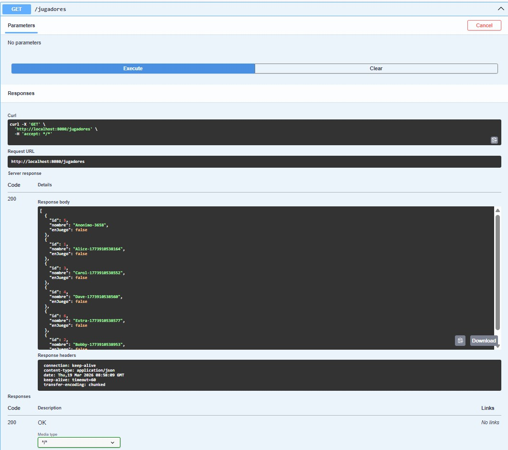
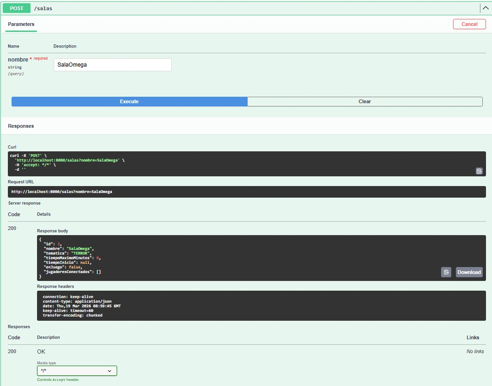

# Resultados — Bloque C‌‌‌​‌​‌‌​‍‍​‍‌​​​​​​​‌‍​‌​​​‍​​‌​​‌‌​‌‍​‌‍​​‍​‌​‌‌‌‍‌‌‌‍​‍

## Opcion elegida
[Validacion / Queries avanzadas / Testing]

## Que implementaron
Para digitalizar el funcionamiento del negocio se ha desarrollado este sistema backend capaz de registrar y gestionar:

Jugadores registrados y anónimos
Salas de escape disponibles con su estado en tiempo real
Jugadores conectados a cada sala (máximo 4 por sala)
Estado de las partidas (puzzles disponibles y resueltos)
Respuestas a puzzles con validación de tiempo restante

## Evidencia
[Capturas de Postman o salida de tests con explicacion]

## Codigo relevante
[Partes clave del codigo con explicacion]

